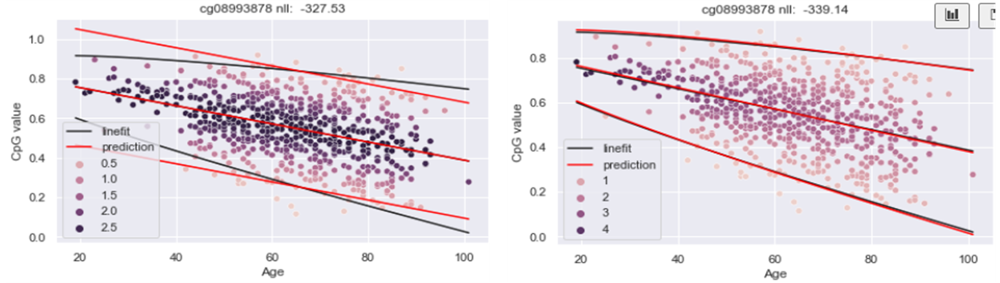
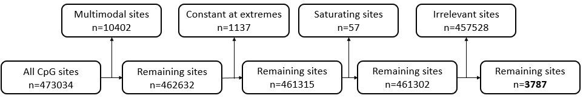
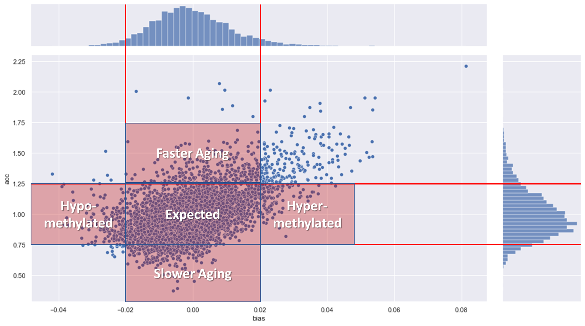

<!---
Abstract: Measure how healthy someone is/ measure his epigenetic age
-->
In this project we model human epigenetic aging (eAge) process with the aim of making clinically useful predictions about personal health. eAge process (clock) is a process of methylation values changing with the chronological age (chAge) at specific CpG sites. Current approaches use clocks to predict individual's chAge or his general health and mortality. However, these methods are limited in the structure they use. We compare individual's eAge to the normal eAge process in the population and based on the likelihood of his methylation values we infer two parameters. First parameter measures how accelerated the change of his methylation values is compared to the normal process, in other words how accelerated his aging is. Second parameter expresses how much of an absolute offset there is in between the person's eAge process and the normal process, how biased his methylation values are. Using Generation Scotland dataset $(n=4550)$, we show that individuals are significantly accelerated in aging when smoking $(F=25.4$, $pvalue=4.8*10^{-7})$ or drinking $(F=6.29$, $pvalue=0.01)$. There is more experiments to follow. This framework allows for a better understanding of aging and an analysis of how it's affected by lifestyle factors, diseases and rejuvenation techniques. What is more, it can be used as a tool for a general health prediction. 

# Introduction

<!---
Why this Problem: This can be applied to understand actual aging better
-->
- [ ] General paragraph why aging is a good problem

Epigenetic age (eAge) is a particularly useful measure that reflects individual's intrinsic biological state and his propensity to disease and death. While the chronological age (chAge) is already a great mortality predictor, it does not consider the environmental and inheritable factors affecting individuals. In contrast, eAge is built on methylation information which directly responds to the environment person is in. This makes eAge a great tool not only for evaluating person's general health and age-related disease risk factors, but also to understand the underlying biology and tests for rejuvenation techniques.

Methylation is an epigenetic process that controls gene expression in cells. It is formed by a chemical reaction happening in DNA, resulting in a methylation group being attached to a specific sequence of base pairs - cytosine followed by a guanine, referred to as a cytosine-phospho-guanine (CpG). CpG methylation in gene promotor regions controls the expression of the gene. The most common method of methylation measurement is bisulfite sequencing. Multiple cells are grown or sampled from a person and their epigenetic information is transformed to genetic information, sequenced with next gen sequencing, and compared with a reference genome (Singer, 2011). Since the presence of a methyl group in a CpG site is binary on a single cell level, initially each CpG site has a value of 0 or 1. In bulk sequencing, the single cell methylation is averaged across multiple cells. The entire process is mass scaled by companies like Illumina with Infinium arrays measuring up to 850 000 sites. See [@Fig:methylation_data_sourcing] for a visualisation of the process.

{#fig:methylation_data_sourcing}

Those sites can be used to create an eAge clock that makes a prediction for a person. A Lasso Linear Regression model is trained on a dataset to learn the coefficients for optimal sites that when combined with methylation values of a person, give a prediction of age. The difference between the prediction and the chAge, the age offset, was found to correlate with many age-related diseases. 

<!---
Attempts: Using omics data because the problem is so complex
-->
**Related Work**

The history of eAge clocks development can be summarised in two generations. First generation methylation clocks predict the chronological age using the epigenetic age as a proxy. Their creation was initially driven by curiosity, where in 2011 researchers noticed a relation between the methylation value and age in human saliva samples [@bocklandt2011epigenetic]. Despite having only 100 saliva samples, the clock was able to predict chAge with accuracy up to 5 years. At this stage it was thought of as tool with usage as chAge prediction in fields like forensics. Two years later, one of the co-authors of the initial paper has expanded its application on a bigger dataset with multiple tissues [@horvath2013dna]. With more than 8 thousand samples the clock not only improved its accuracy but also showed interesting results in particular the brain tissue aging slower than blood cells. More importantly, Horvath showed that the error clock makes when predicting someone's age (age offset) correlates not only with lifestyle factors such smoking and drinking, but also with age-related diseases such as cancer or later down syndrome. His results suggested that certain diseases can accelerate the aging process while others do not. Epigenetic clocks can identify this by measuring the prediction offset, therefore they can be used as predictors for these diseases. Importantly, while multiple diseases were identified, not all of them show this behaviour. Since then, many clocks were developed, reducing the number of used CpGs to just 3 [@weidner2014aging] or improving the prediction error to just two years [@zhang2019improved].

Second generation clocks shift their focus from predicting chAge to predicting mortality/disease risk. This decision was motivated by the shortcomings of the first generation clocks - their inability to be a general disease predictor. First, in 2017 Zhang used the changes in methylation values in 10 CpG sites to predict person mortality risk [@zhang2017dna]. Later, the composite clocks were created using multiple biomarkers as a learning target, rather than just the mortality risk. In 2018 Levine created a clock that used methylation values and chAge and other clinical markers [@levine2018epigenetic]. In 2019 [@lu2019dna] proposed a two stage clock. In the first stage, methylation values are used to predict the level of proteins related to mortality and disease. Additionally, it also predicts packs of cigarettes smoked in a year which is another strong disease and death predictor. These are then combined in the second stage to estimate the time to death. Second generation clocks are generally better at identifying various diseases, while sometimes not even including the chAge in training, such as in the case of [@lu2019dna].

<!---
The Gap: 
-->
**Limitations**

The process of epigenetic aging is not well understood despite the field having made a significant progress in age and mortality prediction. We argue that the papers mentioned d above by focusing explicitly on chAge or mortality prediction, reduce the amount of information about the underlying epigenetic process. 

First generation clocks focus on chAge leads to extremely accurate clocks that lose the associations with diseases and mortality, as pointed out in [@zhang2019improved]. The initial success of identifying some of the diseases in [@horvath2013dna] came from not having too many smokers or cancer patients in the dataset. The model did not gain much accuracy by predicting them accurately. As the datasets get bigger, so do the previously underrepresented subpopulations. Having plenty of CpG sites to chose from, the linear regression model can accommodate for those subpopulations by picking up sites that identify them. However, since these sites do not necessarily need to change with age, it reduces the information about the underlying epigenetic process. You cannot differentiate between a smoker and nonsmoker of the same chAge because your model is too good at predicting their chAge. This phenomena of constant sites can already be observed in the published clocks, with some sites not changing with age. See [@Fig:smoker-site]

{#fig:smoker-site width=60%}

Second generation clocks fall victim to a similar problem, with their focus on mortality and disease. While mortality is related to chAge, a lot of other factors play a role in it. CpG sites picked up in training don't necessarily correlate with aging but with other biological factors. eAge stops being the only target of the model. Instead the clock attempts to model multiple biological systems at once, what is useful in immediate application to healthcare but but not necessarily for a long term understanding of causation. What is more, researchers hand picking the biomarkers, introduce bias to the model, possibly missing some information or biasing the model towards a certain populations. The original motivation of second generation models to predict mortality instead of age is not optimal. For example, some diseases might not be affecting the epigenetic aging process, therefore they might simply be not picked up by the model. Age-relatedness of certain diseases could be a novel peace of information instead of a failure. 

{#fig:age-offset-problem width=60%}

Finally, we believe that current approaches do not tackle of the inherent problems of eAge process. eAge can progress at different speeds compared to chAge and methylation values don't necessarily follow the same process in all the people. If two people have an age offset of +5, but one is aged 20 and the other aged 60, the younger person is clearly accelerated, he is aging at a much faster rate. However, current approach does not differentiate in between them. See [@Fig:age-offset-problem] for a visualisation of the problem. 
What is more, some biological processes cause a global hypo (less) or hyper (more) methylation across all the sites, for example cancer. There is also technical factors that can cause a similar effect, with batch effect simply making all methylation values higher or lower. Having such a global bias does not necessarily mean a faster rate of aging. However, current techniques treat a biased person just as they do an accelerated one. 

**Contribution**

We propose a novel model of methylation values changes with time. While previous approaches used the epigenetic age process to make a chAge/ mortality prediction, we instead focus on modelling the epigenetic age process itself. First we select only sites that have a linear relationship with age. This provides information about how the epigenetic process progresses through time. Doing this step explicitly unsure that any sites that reduce information about the epigenetic process are removed. Then we model the distribution of peoples' methylation values in those linear sites. This allows us to measure the likelihood of a person, and have a rich metric based not only on the age offset but also on the distribution of the values. Finally, using our knowledge about what a normal eAge process looks like in the population, we infer parameters about specific people themselves. Using a probabilistic approach, we are able to see if a person seems to have higher likelihood following different speed than others (acceleration), or having a global offset to all his methylation. Those parameters together offer insight into person's eAge process and show significant associations with age-related lifestyle factors. 

# Methodology
Dataset used in this project is Generation Scotland dataset. While the dataset is much bigger, the experiments conducted here looked at 4550 people, each having their DNA methylation measured at 700 000 CpG sites. The age of participants ranged from 19 to 101, majority of them being around 60. It is a cross sectional dataset; everyone had the methylation measurement taken only once. On top of that, participants went through a basic medical checkup (blood pressure, blood test, body fat etc.) and answered a questionnaire with information like their lifestyle (smoking, drinking) and self-declared diseases. 

## Selecting sites linear with respect to time
<!---
What? Selecting sites where time explains change in methylation 
-->
In the first step, we selected only the CpG sites whose changes in methylation values can be explained by age. There is a linear relationship in between them and when age changes, so does the methylation value. This is in contrast with the sites that don't offer differentiation in between the methylation value at an early age vs.~at the older age. See the [@Fig:site-types] for examples from Generation Scotland dataset.

{#fig:site-types}

<!--
Why? Time related sites are useful for getting age deviation
-->
We select linear sites as a data preparation step to only use the sites that are useful in age prediction. We do this in order to prevent the problem of previous approaches, where training a model with all the sites causes a selection of sites that are disease predicting rather age predicting. See the argument in the Related Work section.

<!--
How? We perform non-parametric selection based on statistics
-->
To select linear sites, we train a linear regression model on all CpG sites and calculate the coefficient of determination statistic ($R^2$) in between the methylation value and age.  We proceeded to set a threshold of $R^2>0.1$ to select linear sites. We also explored sites that are high in variance. This was motivated by observing the distribution of $R^2$ values and how this threshold discards majority of them. It turned out most of them are the very constant or multimodal sites. See figure [@Fig:site_selection_threshold] for the plot of sites $R^2$ and variance. 

{#fig:site_selection_threshold}

To identify the multimodal sites, first, we computed histogram of CpG values and fit a Gaussian Kernel Density Estimate (KDE) on the resulting distribution. Then we used python's SciPy signal processing function to find peaks in the distribution. The package allows for a prominence parameter, which is defined as a vertical distance from the top of the peak to the surrounding baseline. Handpicking a prominence value suitable to the data at hand produced satisfactory results.

## Measuring person methylation likelihood 
<!--
What? Measuring the probability of methylation value given the age mean
-->

Our fundamental measure of person's biological age is the deviation of his methylation value from what is expected at his chronological age. When observing a single linear CpG site, each year is a slice in which the methylation values of the people fall into a distribution. See the [@Fig:methylation_value_slice] for an example of person aged 60 and his value in a distribution for a given age.

{#fig:methylation_value_slice}

This distribution can be approximated by a normal distribution. Since the mean of the year's distribution changes as the time passes, we can express it using a linear equation $at+b$. The variance is to be constant $c$. When randomly sampling from the distribution, we are more likely to observe a person closer to the mean; person likeliness is high. This is the probabilistic view of ordinary linear regression, given by an equation.
$$
\mathcal{N}(\ \mu=at + b, \quad \sigma=c \ )
$$

In order to get rid of saturating sites, we also model the site's distribution with variance that is changing with time $\sigma=ct$, where $c>0$ meaning that variance cannot decrease. 

<!--
Why? Probabilistic approach gives us a confidence measure/interval
-->
We express person's likelihood in a distribution instead of measuring the distance from the mean because it gives us more information. Like discussed in the Related Work discussion, the distance from the mean does not carry it's meaning when observed in a different distribution. Additional benefits of this approach is the ability to experiment with various models and distribution and understanding which explain the data better. For example by allowing for variance to only grow with time, we can explicitly identify which sites are saturating. This is important, because since we are interested in the distribution of the methylation values and reaching the saturation point skews the distribution.

<!--
How? We compare ordinary linear regression with weighted and different value distributions
-->
To measure person's likelihood, we compared two models for each site. The first model was an ordinary linear regression, where the complete probability of a site $i$, given mean slope $a_i$ and intercept $b_i$ and constant variance $c_i$, is a product of probability density function for each person methylation value $m$. Importantly, this model assumes variance that is constant with time. The complete model probability is given a product of all sites $i$.
$$
P(m|t, a_i, b_i, c_i) = \prod_i\mathcal{N}_{pdf}(m; \ a_it+b, \ c_i)
$$
The second model we tested was modifying the assumption of constant variance, allowing for variance parameter $c_i$ to change with time. 
$$
P(m|t, a_i, b_i, c_i) = \prod_i\mathcal{N}_{pdf}(m; \  a_it+b, \  c_it)
$$

See the figure below for a comparison of the models, where each person is coloured by the intensity of its likelihood and the sites total likelihood expressed with negative log likelihood.

{#fig:lin_drift_comparison}

We then optimized the site parameters ($a_i, b_i$ and $c_i$) to minimize the negative log likelihoods for both models for all the selected sites. Finally, we performed model comparison using the Akaike Information Criterion, that takes into account the total likelihood and the number of parameters, and gives a probability of a given model being the correct one for a given CpG site. For further analysis, we selected sites that were best explained by the linear variance model.

## Measuring person aging acceleration and bias
<!--
What? Having a measure of how quickly someone is aging and whether he has a global age offset
-->
Once the person likelihoods are computed on all optimal CpG sites, we can combine them into a single measure. When observing the methylation values of a single person across the optimal sites, we model them with a normal distribution. Additionally, we can introduce new parameters that can be inferred based on the knowledge of already computed site parameters $a_i, b_i$ and $c_i$.
$$
P(m|t) = \mathcal{N}_{pdf}(m; \  \alpha a_it + b_i + \beta, \  c_it)
$$

Aging acceleration $\alpha$ is a single measure of how accelerated the person's aging is, in regards to what is a normal, "healthy" speed of aging $a_i$ across all the optimal sites. An acceleration of 2 would mean that this person ages twice as fast as an average person of his age, acceleration of 1 would mean they age in the same rate. What is important, acceleration modifies the speed of aging $a_i$, the slope of the site which can be both negative and positive; positive acceleration returns higher methylation values on sites increasing with age and negative acceleration returns a lower values on decreasing. See [@Fig:accelerated_invidividual] for an example.

{#fig:accelerated_invidividual}

Additionally, person bias $\beta$ is a measure of global hypo or hyper methylation in regards to what is a normal methylation value at the given age $a_it+b_i$ across all the optimal sites. Person bias equal to 0.1 would mean that across all the sites the methylation value is shifted 0.1 above the mean for his age, bias of 0 would mean there is no shift. What is important, bias modifies the absolute methylation value; it affects both the increasing and decreasing sites equally. See [@Fig:biased_individual] for an example.

{#fig:biased_individual}

<!--
Why? We have more information than just the age offset
-->
The advantage of modelling the age acceleration instead of just the age offset is an ability to combine person likelihoods computed in the last step, into a single measure. Age acceleration, like the likelihood, has an advantage over the age offset by including the knowledge about the distribution of the values.  

We also model the person bias because it allows us to differentiate in between the hypo/hyper-methylated people and the faster/slower aging people. As explained in the Related Work section, the current techniques mispredict the age offset when applied to a person with a bias. With our approach, we are able to capture that bias and control for it when measuring the acceleration. If our model is applied to a completely new dataset, it will capture that fact with the bias.  

Finally, the probabilistic approach allows for a computation of the parameter posterior distribution, which gives confidence into the parameter value. The narrower the distribution, the more confident we can be in the peak being the value. See [@Fig:acc_bias_posterior] for an example.

{#fig:acc_bias_posterior}

<!--
How? We model a person with a single alpha and beta parameter
-->
To implement this step, we compute the total likelihood for each person $j$ as a product of his likelihoods across all the CpG sites, modifying the distribution mean by the acceleration $\alpha^j$ and the bias $\beta^j$. We already know the site parameters from the previous step.

$$
P(m|t) = \prod_i\mathcal{N}_{pdf}(m; \  \alpha^j a_it + b_i + \beta^j, \  c_it)
$$

We perform an AIC model comparison of this model against a null model without the acceleration and bias parameter and compute the posterior distribution by sampling over the space of acceleration and bias parameter.

# Results
## Site selection
Site selection was the first step of our analysis. Its aim was to select only the sites significantly changing with time while also maintaining its variability. We completed that in two steps. First by selecting the sites with a coefficient of determination $R^2>0.1$ and variance $\sigma^2>0.001$. Second, by selecting the sites that were best explained by a model that assumed variance that is changing with time and not decreasing.

In general, while most of the sites were discarded, there is a significant amount sites useful to explain changes of methylation with age. See [@Fig:site_filtering] for exact numbers.

{#fig:site_filtering}

There were numerous (n=10402) "multimodal" sites that were not explored in the literature before. We hypothesize they might be a result of genetic mutations in the population.

In the second step of site selection, we measured how much more likely a site is to be explained by a constant variance model vs. the linear variance. As expected, most of the sites showed a very strong probability for the linear variance model. The constant variance model, since its variance was not changing with time, was better at explaining the sites with constant variance (correlation of variance with time $var_r$ was close to zero). Constant variance was also better with the sites decreasing with time since the linear model could only increase and staying constant is closer to decreasing. As a result, the linear variance model captured most of the sites rich in variance. See [@Fig:model_comparison_hist] for results.

{#fig:model_comparison_hist}

## Person modelling
After selecting the sites whose methylation values change with time while maintaining the variability of the data, we modelled each person. We first computed the likelihood of his methylation values in each CpG sites. Then used these results to estimate two unique parameters for each person. One is age acceleration that expresses how much faster the methylation values of this person are changing compared to the normal slope i.e. this person is aging faster. The second one is person's bias, meaning the global offset of all methylation values, measuring his hypo/hypermethylation.

Both the accuracy and bias ranged within the expected values. Both old and young people shower a propensity for faster aging. This is has a plausible explanation, as both the younger and older people can engage in activities known to increase aging like smoking etc. This means that the acceleration parameter carries information different than age. What is interesting, the bias parameter tended to have a higher range for older people. See [@Fig:acc_bias_change] for visualisation.

{#fig:acc_bias_change}

We can compare both the acceleration and bias to identify subgroups in the population. As expected, majority of the people have an acceleration value close to 1, and bias close to 0. Those people form the Expected group. People whose acceleration reaches higher/lower values while still having a small bias can be thought of as accelerated; either faster or slower aging. Finally, people whose bias is high seem to be hypo/hyper methylated.  

{fig:acc_bias_map}

## Association study
Generation Scotland is rich with participants' phenotype data. The preliminary studies have showed a statistically significant relation in between the person's acceleration and his reported smoking and drinking status. The statistic for smoking is $F=25.4$ for the pvalue of $pvalue=4.8*10^{-7}$, while for drinking, it's $F=6.29$ for the pvalue of $pvalue=0.01$. See [@Fig:smoking_drinking_ANOVA] for a visualization.

{#fig:smoking_drinking_ANOVA}

What is interesting, those relations were present only for the acceleration but not the bias.

# Conclusion
This project has a few more areas to work on. With an aim of publication in the first semester of this year, we are working on the association studies and survival analysis to validate our results. Due to the inexperience of the author in statistical analysis, we requested support from a different lab that worked with Generation Scotland extensively.

We are also experimenting with different models to measure person's methylation value likelihood in a site. We made several assumptions in the initial model, such as that the relationship will be linear while it doesn't have to be. Another assumption is that the distribution of the values is normal, while it clearly is not when the distribution mean approaches values close to 0 or 1. For example a Beta distribution would be more in place.

In the long term, we want to develop our model into a tool that can be applied in medical practise. With the advantage of having a bias parameter we can correct for any batch effects in between the datasets. This will require a thorough validation on an external dataset. Fortunately there are many published datasets allowing for that. This step will probably be completed later in during this year.

We are also interested in understanding the biology. Population dynamics has many approaches fitting the scenario of methylation. Two colony model assumes two populations (methylated and unmethylated cells), each growing independently (cells are dividing) while there is a migration process in between the populations (cells are gaining/losing methylation). Implementing this model and fitting the data to it could allow us to determine parameters such as the rate of cell division and the rate of methylation. By applying this approach to different human tissues we could estimate those values for each separately, increasing our overall biological knowledge. This approach might also be applied to different species with similar results.

Overall, while this project is at an early stage of development, it presents promising results and many extensions that could prove very useful and interesting. 