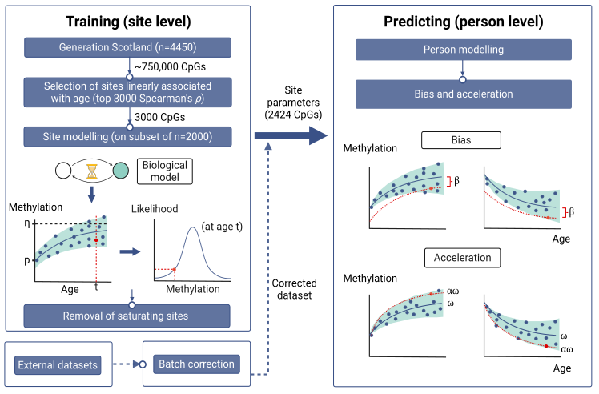

# ProbAge: Probabilistic Inference of Epigenetic Age Acceleration

<div align="center">
    
</div>

## Overview

ProbAge is a Python package implementing the probabilistic model for epigenetic age acceleration analysis described in "Probabilistic inference of epigenetic age acceleration from cellular dynamics" (Nature Aging, 2024). This tool provides a mechanistic approach to understanding methylation dynamics and biological aging, addressing limitations in traditional epigenetic clock methods.

### Model Architecture
<div align="center">
    
</div>

### Key Features

- Probabilistic modeling of methylation transitions at the cellular level
- Distinction between acceleration and bias components in methylation dynamics
- Robust inference framework tested on large-scale cohort data
- Compatible with both local execution and cloud-based analysis

## Installation

### Local Installation

1. Clone the repository:
```bash
git clone https://github.com/username/probage.git
cd probage
```

2. Create the conda environment:
```bash
conda env create -f env/probage.yml
conda activate probage
```

## Usage

### Local Analysis

To analyze your cohort data locally:

1. Modify the data path in `any_cohort_run.py` to point to your methylation data
2. Set parameters to choose wether to retrain model or not.
3. Run the analysis:
```bash
python any_cohort_run.py
```

### Cloud-Based Analysis

Access our web interface at [https://probage.streamlit.app/](https://probage.streamlit.app/) for cloud-based analysis.

## Data Format

Your input data should include two components:

### 1. Methylation Data Matrix
- Format: Rows as CpG sites, columns as samples
- Values: Beta values (0-1 range) representing methylation levels
- File format: CSV or similar tabular format

### 2. Metadata File
Required columns:
- `age`: Numerical values representing the chronological age of each sample
- `control`: Boolean values (True/False) indicating which samples should be used for batch correction
  - Set to `True` for samples that represent the "normal" or "healthy" population
  - Set to `False` for samples from the group being studied (e.g., disease group)
  - Example: When studying disease acceleration, set `control=True` for healthy participants and `control=False` for disease participants
  - Example: When studying a cohort of healthy participants, set 'control=True' for all participants.

Additional columns are encouraged and can be included for further analysis. Common examples:
- `sex`: Biological sex of the participant
- `smoking_status`: Smoking history
- `bmi`: Body Mass Index
- `disease_status`: Specific conditions or phenotypes
- Any other sample-level information relevant to your analysis

Example metadata format:
```csv
sample_id,age,control,sex,smoking_status,treatment_group
SAMPLE_001,45,True,F,Never,Placebo
SAMPLE_002,52,True,M,Former,Placebo
SAMPLE_003,48,False,F,Current,Treatment
```

Note: The batch correction process uses only samples marked as `control=True` to establish the baseline methylation dynamics, ensuring that the acceleration estimates are not confounded by the condition being studied.

## Citation

If you use ProbAge in your research, please cite:

```bibtex
@article{dabrowski2024probabilistic,
    title={Probabilistic inference of epigenetic age acceleration from cellular dynamics},
    author={Dabrowski, Jan K. and Yang, Emma J. and Crofts, Samuel J. C. and Hillary, Robert F. and Simpson, Daniel J. and McCartney, Daniel L. and Marioni, Riccardo E. and Kirschner, Kristina and Latorre-Crespo, Eric and Chandra, Tamir},
    journal={Nature Aging},
    volume={4},
    pages={1493--1507},
    year={2024},
    publisher={Nature Publishing Group}
}
```

## Model Details

ProbAge introduces two key components for analyzing epigenetic aging:

1. **Acceleration**: Measures the proportional increase in methylation transition speeds across CpG sites
2. **Bias**: Quantifies global changes in methylation levels

These components provide mechanistic insights into aging-related methylation dynamics and help control for confounding factors in traditional epigenetic clock analyses.

## Contributing

We welcome contributions! Please feel free to submit a Pull Request.

## License

This project is licensed under the MIT License - see the LICENSE file for details.

## Contact

For questions and support:
- Create an issue on GitHub
- Contact the authors through the corresponding author information in the paper

## Acknowledgments

This work was developped using data from the Generation Scotland study.